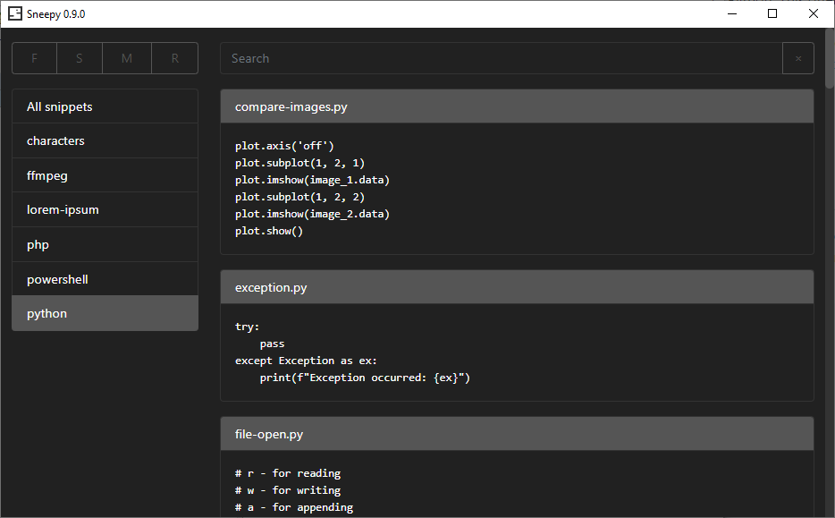

# Sneepy - Snippets manager

Sneepy is file and folder based snippets manager for Windows written in Python.

For more information read [How to use Sneepy](./docs/how-to.md).

## Run sneepy

Release build is not available yet, so you need to run Sneepy directly:

	cd /sneepy/
	pip install -r requirements.txt
	python __main__.py