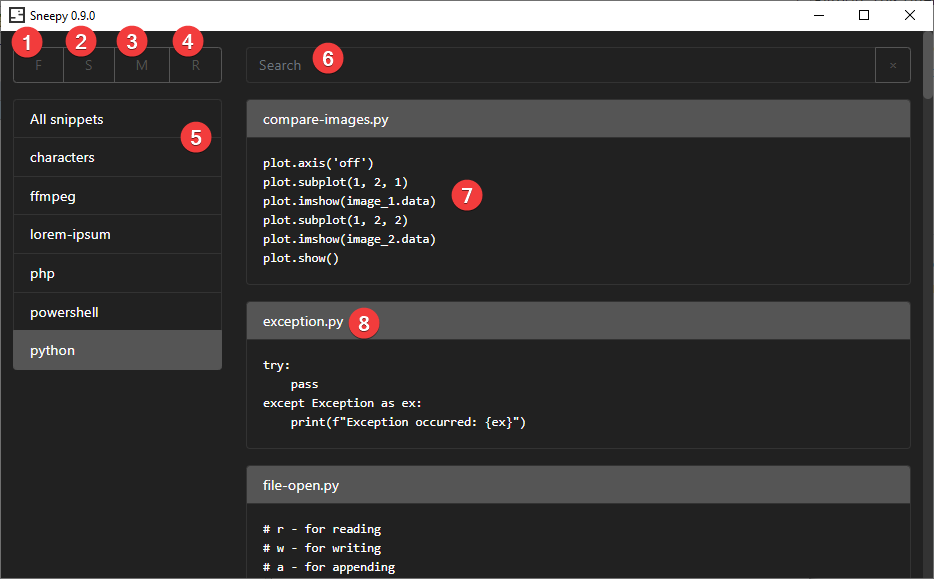

# How to use Sneepy

## Configuration

You can edit `sneepy.xml` file to change configuration:

* `snippetsFolder` - set your snippets folder (default is `snippets`, placed in same folder as Sneepy) 
*Hint: use some synchronized folder (Dropbox, Google Drive, ...) or Git for backups*
* `autoMinimize` - Sneepy will be minimized after snippet is copied
* `window` - set window `width` and `height`

## Using Sneepy

* Create folders `[1]` and files `[2]` - new snippet will be opened in *notepad*
* Manage your snippets `[3]` - this will open snippets folder in *Windows Explorer* so you can edit everything
* Filter snippets by folders `[5]` or search query `[6]`
* Copy snippet to clipobard `[7]`
* Edit snippet `[8]` - this will open snippet in *notepad*

### File/folders structure

* Sneepy scans your snippet folder during start (or clicking on the *Reload* button `[4]`)
* Required folder structure is flat - just folders (without subfolders) and files

#### Folder structure example*

* python
  * snippet.txt
  * hello-world.py
* javascript
  * hello-world.js
* etc.